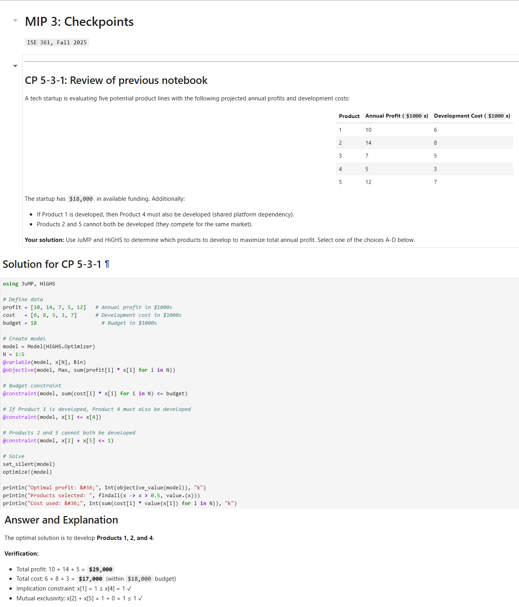
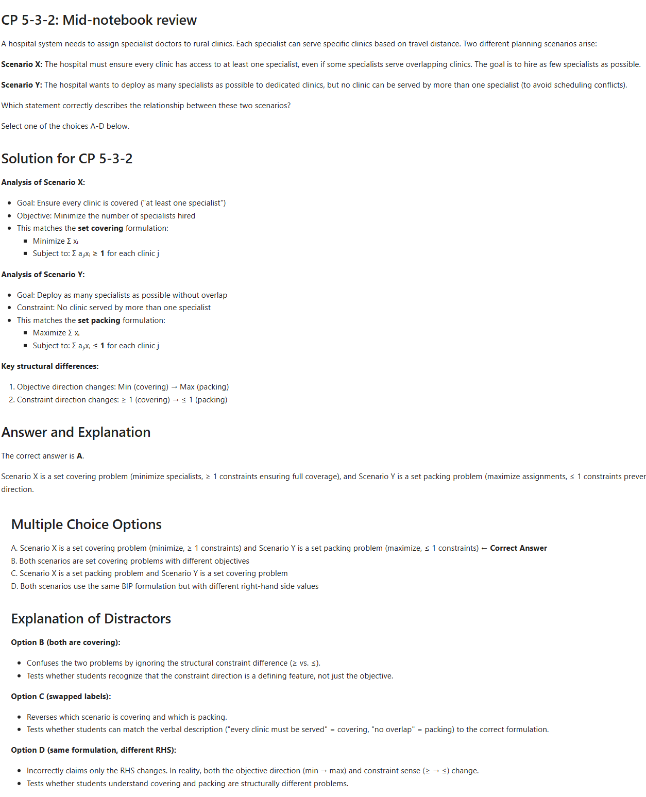
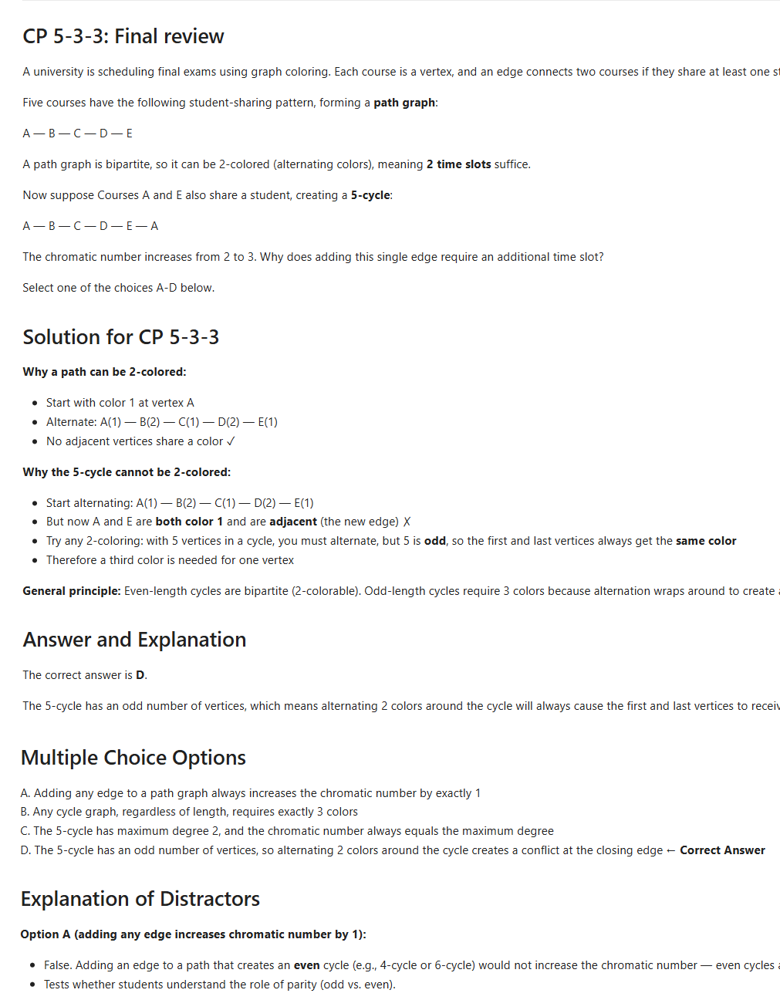
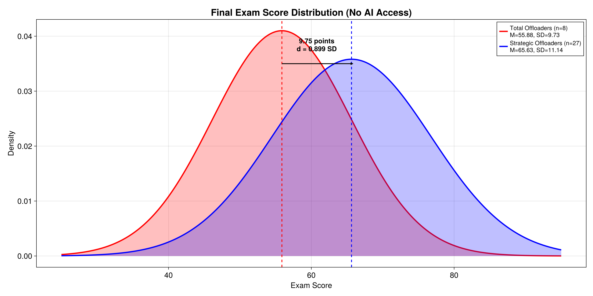
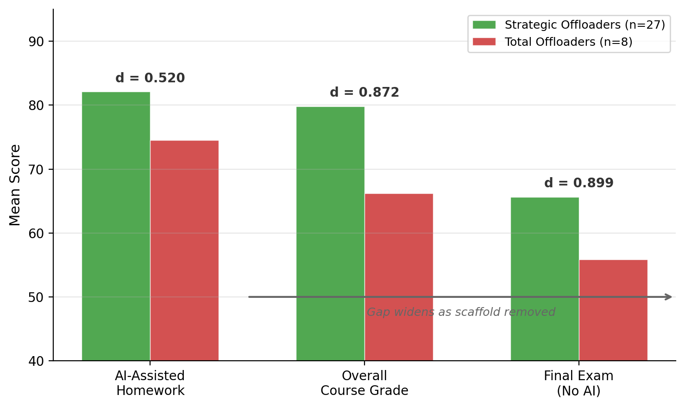
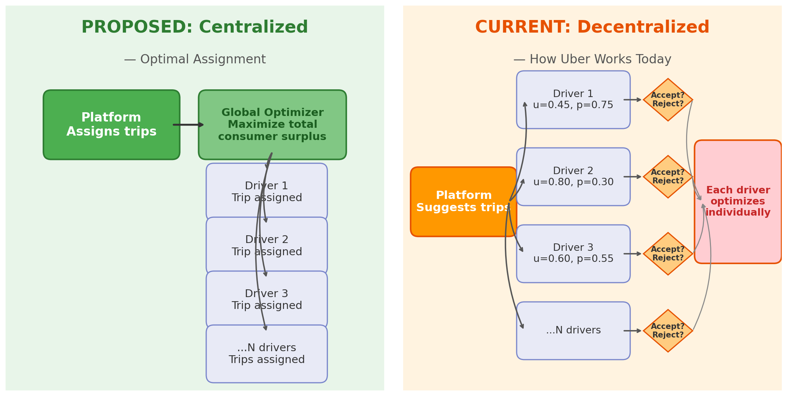
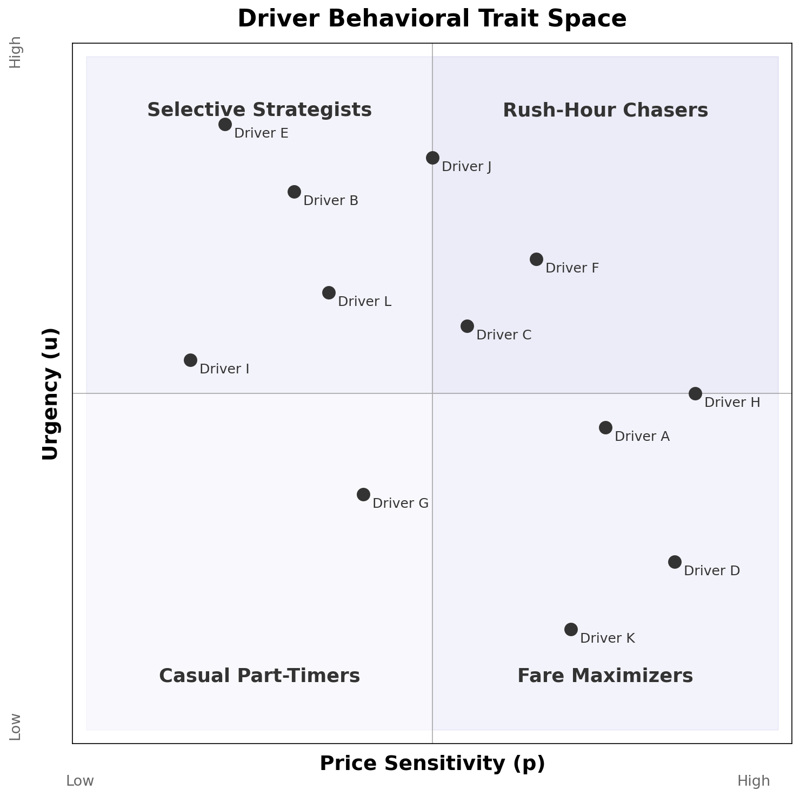
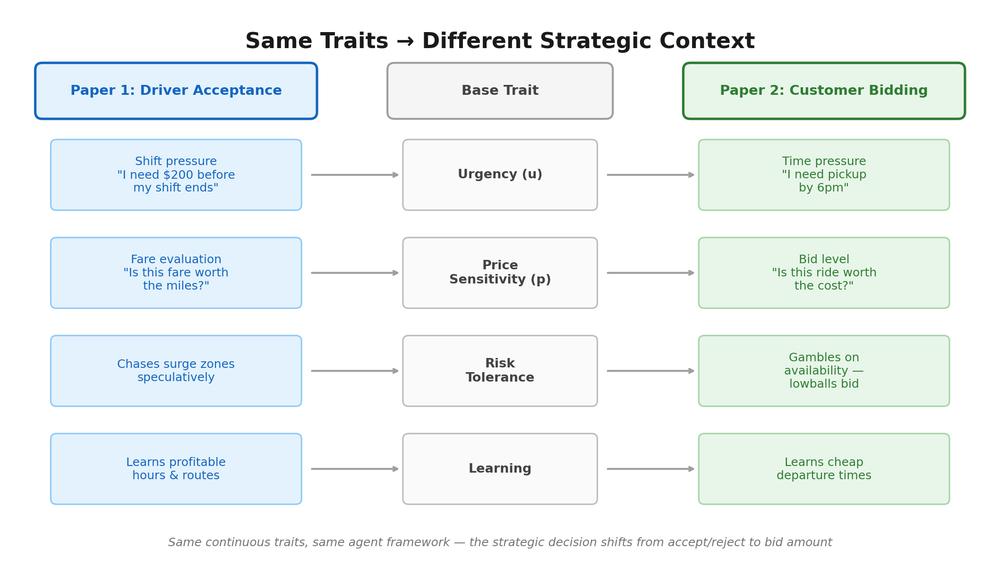

## Roadmap {.smaller}

Three-part structure:

:::: {.columns}

::: {.column width="33%"}
::: {.stat-block}
[1]{.stat-value}
[Evolution]{.stat-label}

How we got here (Pre-2022 → Fall 2025)
:::
:::

::: {.column width="33%"}
::: {.stat-block}
[2]{.stat-value}
[Research Results]{.stat-label}

What we found (n = 35, Fall 2025)
:::
:::

::: {.column width="33%"}
::: {.stat-block}
[3]{.stat-value}
[The Future]{.stat-label}

Where this is going (PCV, agentic economy)
:::
:::

::::

---

## The Engine of AI: Utter Simplicity at Scale

:::: {.columns}

::: {.column width="55%"}
### Next-Token Prediction

<div style="font-size: 0.75em; font-weight: bold; color: #555; margin-bottom: 0.2em; text-align: center;">Context Window</div>
<div style="border: 2px solid #999; border-radius: 6px; background: #f8f8f8; padding: 0.6em 0.8em; min-height: 2.4em; font-size: 0.85em;">
::: {.r-stack}
::: {.fragment .fade-in-then-out}
▌
:::
::: {.fragment .fade-in-then-out}
*One small step for man, one giant*  ▌
:::
::: {.fragment .fade-in-then-out}
*One small step for man, one giant* **leap**  ▌
:::
::: {.fragment .fade-in-then-out}
*One small step for man, one giant leap* **for**  ▌
:::
::: {.fragment .fade-in}
*One small step for man, one giant leap for* **mankind.**
:::
:::
</div>

That's it. Predict the next token. Repeat.

A **token** $\approx$ ¾ of a word. **Context window** = LLM's working memory — a finite bucket of tokens.
:::

::: {.column width="45%"}
### Why It Works

```{mermaid}
%%| fig-width: 6
flowchart LR
    C["`**Context Window**
    *(tokens)*`"] --> L["`**LLM**`"]
    L --> P["`**Predict
    Next Token**`"]
    P -->|"append"| C
```

::: {.highlight-box}
**Self-verification at scale**

Text contains its own test suite — hide the next word, guess it, check.

*The breakthrough wasn't better algorithms; it was more compute applied to this simple game.* — Sutton's "Bitter Lesson"
:::
:::

::::

::: {.notes}
Based on Stephen Wolfram's explanation of LLMs. The key insight: the mechanism is trivially simple. What made it powerful was scaling compute (Sutton's Bitter Lesson). Tokens will reappear later when we discuss agents — an agent is just an LLM that manages its own context window autonomously.
:::

---

## Part 1: Evolution {.section-divider}

How we got here

---

## The Verification Era

:::: {.columns}

::: {.column width="55%"}
LLMs self-verify by predicting text. In practice, the scarce *human* skill is verifying AI output matches intent:

> *"AI is not end-to-end but middle-to-middle."* — Balaji

> *"You're not going to lose your job to AI but to someone who uses AI better than you."* — Jensen Huang

> *"How good you are at the thing you're best at determines how powerful an LLM you can reasonably evaluate."* — Byrne Hobart
:::

::: {.column width="45%"}
### New Modeling Workflow

```{mermaid}
%%| fig-width: 5.5
%%{init: {'theme': 'base', 'themeVariables': {'fontSize': '14px', 'primaryColor': '#fff', 'primaryBorderColor': '#CC0000', 'lineColor': '#CC0000'}}}%%
flowchart LR
    W["`**What & Why**
    *Human*`"] -->|"prompt"| H["`**How**
    *LLM*`"]
    H -->|"output"| V["`**Verify**
    *Human*`"]
    V -->|"refine"| W
```
:::

::::

::: {.highlight-box}
**Scarce skill is now verification, not production.**

Human (what/why) → LLM (how) → Human (verify)
:::

::: {.notes}
These three quotes frame the entire presentation. Balaji's quote establishes that AI operates in the middle of a workflow — humans provide the beginning (what/why) and the end (verification). Jensen Huang's quote motivates the student angle. Byrne Hobart's quote connects verification skill to the ability to leverage AI effectively.
:::

---

## The Syntax Barrier (Pre-2022)

Julia — modern, high-performance, ideal for computational logistics — but steep learning curve created classroom barriers:

- Students drowned in syntax errors instead of system design
- Cognitive load spent getting code to run, not modeling
- Workaround: MATLAB instead of Julia to keep courses manageable
- Sacrificed exposure to modern tools for teachability

```{mermaid}
%%| fig-width: 14
timeline
    Pre-2022 : Syntax barrier
             : Students struggle with Julia
    Nov 2022 : ChatGPT arrives
             : Solves basic syntax homework
    Fall 2024 : Turning point
              : Custom GPT + Julia manual
    Fall 2025 : Course redesign
              : Two new AI-integrated elements
```

---

## First Contact with AI (2022–2023)

**Fall 2022** — PhD-level Logistics Engineering course, taught in MATLAB. ChatGPT launched in November — solved basic syntax homework flawlessly but hallucinated on complex design problems.

**Fall 2023** — Undergraduate supply chain course, Python. AI offered as optional tool with extra credit for documenting use:

- Helpful for debugging and conceptual queries
- Still weak at quantitative coding and optimization modeling
- No threat to design-level work yet

::: {.highlight-box}
Gap between syntax help and design help was still enormous.
:::

---

## The Turning Point (Fall 2024)

Same PhD-level Logistics Engineering course from 2022 — but this time, switched from MATLAB to Julia:

- Created Custom GPT loaded with 1,000-page Julia manual
- Overcame context limits standard chatbots couldn't handle
- By December: standard chatbots had caught up natively

::: {.highlight-box}
Path cleared to focus entirely on **design**, not Julia syntax.
:::

---

## Fall 2025: Two Innovations

**ISE 361 — Engineering Optimization** · NC State · Fall 2025

~40 undergraduates · Julia/JuMP · Jupyter notebooks

Two new design elements:

:::: {.columns}

::: {.column width="50%"}
::: {.stat-block}
[1]{.stat-value}
[AI-Generated Checkpoints]{.stat-label}
:::
:::

::: {.column width="50%"}
::: {.stat-block}
[2]{.stat-value}
[Two-Stage Homework]{.stat-label}
:::
:::

::::

::: {.notes}
Brief transition slide — sets up the next two deep dives.
:::

---

## AI-Generated Checkpoints

Checkpoint pipeline:

:::: {.columns}

::: {.column width="33%"}
### Input

Professor's Jupyter lecture notebook

*(e.g., `5-MIP-3.ipynb`)*
:::

::: {.column width="33%"}
### Process

Claude Code reads notes → generates 3 multiple-choice checkpoints (1–4 min each) → distractor analysis
:::

::: {.column width="33%"}
### Output

- Student version: questions embedded
- Instructor answer key: solutions + distractor explanations
:::

::::

::: {.highlight-box}
CP1 reviews previous class · CP2 & CP3 test current session

Strategic distractors expose specific **misconceptions**, not just wrong answers.
:::

::: {.notes}
The pipeline is fully automated — professor provides the notebook, Claude Code generates both versions. Distractors are designed to surface common misunderstandings, making them diagnostic tools, not just assessment items.
:::

---

## Checkpoint Demo



::: {.notes}
Shows Claude Code generating checkpoints from a live notebook. ~3 min runtime.
:::

---

## Checkpoint Output {.smaller}

Three checkpoints generated from one lecture notebook:

:::: {.columns}

::: {.column width="33%"}
**CP1 — Previous Class Review**

{width="100%"}
:::

::: {.column width="33%"}
**CP2 — Mid-Notebook Review**

{width="100%"}
:::

::: {.column width="33%"}
**CP3 — End-of-Class**

{width="100%"}
:::

::::

::: {.notes}
Each checkpoint is 1-4 minutes. CP1 reviews previous class material, CP2 and CP3 test current session. Distractors are designed to surface specific misconceptions — not just wrong answers, but diagnostic indicators of where student understanding breaks down.
:::

---

## Two-Stage Homework

:::: {.columns}

::: {.column width="55%"}
**Stage 1 (50%)** — Independent submission

Solve without AI on solution steps.

**Diagnostic moment**

After submission, receive *answers only* — numerical results, no solution code.

**Stage 2 (50%)** — AI-assisted reconciliation

Resolve discrepancies, submit final version + AI transcript.
:::

::: {.column width="45%"}
::: {.highlight-box}
Creates a natural, honest prompt:

*"I got X, but the answer is Y — help me understand where my approach diverged."*
:::

Submission requires AI dialogue log — making **process**, not just product, visible.
:::

::::

::: {.notes}
The key insight is the diagnostic moment: students see what they got wrong before engaging AI, creating an authentic learning prompt rather than a shortcut-seeking one.
:::

---

## Part 2: Research Results {.section-divider}

What we found (Fall 2025)

---

## Two Patterns of AI Use

Framework: cognitive offloading (Risko & Gilbert)

:::: {.columns}

::: {.column width="50%"}
::: {.stat-block}
[77%]{.stat-value}
[Strategic Offloading (n = 27)]{.stat-label}

Attempt first → debug → ask *why* → verify
:::
:::

::: {.column width="50%"}
::: {.stat-block}
[23%]{.stat-value}
[Total Offloading (n = 8)]{.stat-label}

Paste raw problem → demand answer → complain when wrong
:::
:::

::::

::: {.highlight-box}
n = 35 students submitted AI transcripts (87.5% of class)

A **time capsule** — capturing how students naturally interact with AI in Fall 2025, before norms, guardrails, and institutional policies solidify.
:::

---

## Example - HW 5 Offloading

:::: {.columns}

::: {.column width="50%"}
### S012 — Total Offloader · 54/100

> *"this is the correct answer give me code that will produce this"*

**Platform:** Google Gemini · 19 messages

| Category | Count |
|---|---|
| Conceptual questions | **0** |
| Own code attempts | **1** |
| Raw error pastes | **8** |
| Fix this / demand answer | **10** |
| Verification behaviors | **0** |
:::

::: {.column width="50%"}
### S024 — Strategic Offloader · 94/100

> *"Looking at this code from the original problem... and my code... How can I improve mine"*

**Platform:** ChatGPT · 15 messages

| Category | Count |
|---|---|
| Conceptual questions | **2** |
| Own code attempts | **4** |
| Raw error pastes | **5** |
| Fix this / demand answer | **5** |
| Verification behaviors | **4** |
:::

::::

*Messages may fall into multiple categories.*

::: {.highlight-box}
**+40 points · same assignment · same AI access · same two-stage format**
:::

::: {.notes}
S024 shows a two-phase pattern: in the first half (Q4, msgs 1-8), they write own code, compare to references, ask conceptual questions, and debug real errors. In the second half (Q5 and Q3, msgs 9-15), they shift to pasting TA code and asking AI to restyle it. The verification and conceptual engagement in the first half is what distinguishes them from S012, who never shows this behavior at any point.
:::

---

## Example — Undergraduate Deterministic Modeling Course

:::: {.columns}

::: {.column width="55%"}
{fig-align="center" width="100%"}
:::

::: {.column width="45%"}
::: {.stat-block}
[65.63]{.stat-value}
[Strategic Offloaders (n = 27) — Final Exam Mean]{.stat-label}
:::

::: {.stat-block}
[55.88]{.stat-value}
[Total Offloaders (n = 8) — Final Exam Mean]{.stat-label}
:::
:::

::::

::: {.highlight-box}
**Cohen's d = 0.899 · p = 0.033 · η² = 0.131**

- **9.75-point gap** on final exam — nearly one full standard deviation
- AI interaction quality explained **13% of exam variance** vs. <1% for checkpoints
- **65.2%** of students improved verification behaviors over semester
:::

---

## Scaffold, Not Crutch

:::: {.columns}

::: {.column width="55%"}
Effect size *increases* as AI scaffolding is removed:

{fig-align="center" width="100%"}

::: {.highlight-box}
- AI-assisted homework: d = 0.520
- Course grade: d = 0.872
- AI-unassisted final exam: d = 0.899
- **Gap widens on assessments without AI**
:::
:::

::: {.column width="45%"}
**Verification behaviors** — moments a student pushes back, checks, questions, or tests AI output:

1. **Explicit verification** — *"Why does this approach work?"*
2. **Error refinement** — *"That's wrong because..."*
3. **Testing & debugging** — running AI code, checking against known answers
4. **Metacognitive prompts** — *"What assumptions does this make?"*

Early semester: **14.8%** of messages (~1 in 7)

Late semester: **20.3%** of messages (~1 in 5)

**Students improved these behaviors over the semester**
:::

::::

::: {.notes}
This is the "scaffold, not crutch" evidence — strategic offloaders *internalize* the skills. The effect grows stronger precisely when students can't use AI, meaning the learning transferred. Verification behaviors (our B2 coding category) are our own operationalization, grounded in Risko & Gilbert (2016) metacognitive framework and Hao et al. (2025) SB4 behavioral code. Improvers (n=15) went from 12.4% → 26.0% (+13.5 pp). Non-improvers (n=8) went from 19.2% → 9.8% (-9.4 pp) — they started higher but declined.
:::

---

## Part 3: The Future {.section-divider}

Where this is going

---

## Why AI Works for Code

:::: {.columns}

::: {.column width="40%"}
- Recall: LLMs learn by self-verification — hide next token, predict, check
- Software already had this structure **before AI arrived**:
  - Unit tests *(individual functions)*
  - Integration tests *(functions together)*
  - Smoke tests *(does it run at all?)*
- AI iterates autonomously against this infrastructure
:::

::: {.column width="60%"}
<div style="font-size: 0.65em; text-align: center; margin-bottom: 0.3em;">**The Ralph Wiggum Loop** — *"I'm learnding!"* — <br>Repeated cycles converging on a correct result despite not understanding *why*</div>

```{mermaid}
%%| fig-width: 8
%%| fig-height: 4.5
flowchart LR
    H(["`**Human**
    *prompt + test suite*`"]) --> G

    subgraph RW [" "]
        G["`**Generate**
        *code*`"] --> T{"`**Test**`"}
        T -->|"fail"| R["`**Revise**`"]
        R --> G
    end

    T -->|"pass"| V(["`**Human
    Verifies**`"])

    style RW fill:#f2f2f2,stroke:#CC0000,stroke-width:2px
```
:::

::::

::: {.highlight-box}
Human provides **test suite** and initial prompt. Software was first domain where external verification matched self-verification LLMs were trained on.
:::

::: {.notes}
Callback to the Foundation slide: text has self-verification (next-token prediction). Software extends that with external verification (test suites). This is why "verification" threads the entire presentation. Students who verify (strategic offloaders) are doing what the tools themselves rely on. Ralph Wiggum: the Simpsons character who keeps going despite not understanding why he's wrong.
:::

---

## The AI Tool Spectrum

:::: {.columns}

::: {.column width="33%"}
### Chatbot

```{mermaid}
%%| fig-width: 5.5
flowchart TD
    H([Human]) -->|"prompt"| A([AI])
    A -->|"response"| H
```

::: {.highlight-box}
**The Prompter**

All interaction is human-initiated.
:::
:::

::: {.column width="33%"}
### AI Coding Agent

*(e.g., Claude Code)*

```{mermaid}
%%| fig-width: 5.5
flowchart TD
    H([Human]) -->|"prompt + tests"| A([AI])
    A -->|"execute"| T{Tests}
    T -->|"fail"| A
    T -->|"pass"| H
```

::: {.highlight-box}
**The Manager**

Human provides prompt + tests. AI loops until tests pass.
:::
:::

::: {.column width="33%"}
### Autonomous Agent

```{mermaid}
%%| fig-width: 5.5
flowchart TD
    H([Human]) -->|"sets rules"| P[Protocol]
    P -->|"governs"| A1([Agent A])
    P -->|"governs"| A2([Agent B])
    A1 <-->|"interact"| A2
    A1 -->|"outcomes"| H
    E["`**Environment**
    *(APIs, sensors, data)*`"] <-->|"read/act"| A1
    E <-->|"read/act"| A2
```

::: {.highlight-box}
**The Rule-Maker**

Human defines protocol. Agents interact with each other and environment.
:::
:::

::::

::: {.notes}
"AI Coding Agent" generalizes beyond Claude Code. The Manager role: AI does the detail work, human sets goals and evaluates. Distinct from copilot (human does work, AI assists). For autonomous agents, the human sets the constitution — the protocol and value agenda. The Environment node shows agents interact with the outside world bidirectionally, not just with each other.
:::

---

## From Push to Pull

:::: {.columns}

::: {.column width="48%"}
### Traditional: Push

```{mermaid}
%%| fig-width: 5
flowchart TD
    I([Instructor]) -->|"broadcasts"| S1([Student])
    I -->|"broadcasts"| S2([Student])
    I -->|"broadcasts"| S3([Student])
```

- One-directional flow
- Scales easily but engagement varies
:::

::: {.column width="4%"}
:::

::: {.column width="48%"}
### AI-Mediated: Pull

```{mermaid}
%%| fig-width: 5.5
flowchart BT
    AI[AI Partner] <-->|"handles 'how'"| S1([Student])
    AI <--> S2([Student])
    AI <--> S3([Student])
    S1 -.->|"pulls 'why'"| I([Instructor])
    S2 -.-> I
    S3 -.-> I
```

- Students iterate with AI on *how*
- Pull *why* from instructor on demand
- Previously only feasible in apprenticeships and small seminars
- AI enables Socratic method at scale
:::

::::

::: {.notes}
This is the conceptual shift. PCV (next slide) is one structured implementation, not the only one. The key is that AI enables the Socratic method at scale. The modeling workflow (what/why/how/verify) is the concise version of the PCV cycle.
:::

---

## The PCV Workflow

Structured approach to pull-based learning using Claude Code:

:::: {.columns}

::: {.column width="33%"}
::: {.stat-block}
[Plan]{.stat-value}
[Design questions + Critic review]{.stat-label}
:::
:::

::: {.column width="33%"}
::: {.stat-block}
[Construct]{.stat-value}
[Build from approved plan]{.stat-label}
:::
:::

::: {.column width="33%"}
::: {.stat-block}
[Verify]{.stat-value}
[Check against criteria]{.stat-label}
:::
:::

::::

```{mermaid}
%%| fig-width: 14
%%{init: {'theme': 'default', 'themeVariables': {'fontSize': '13px'}}}%%
flowchart LR
    AI["`**AI**
    *design questions*`"] <-->|"Q & A"| ST(["`**Student**
    *answers trade-offs*`"])
    AI -->|"produces"| PL["`**Plan**`"]
    PL --> CR{"`**Critic**`"}
    CR -->|"challenges"| AI
    CR -->|"passes"| SA(["`**Student**
    *approves*`"])
    SA --> C["`**Construct**
    *AI builds*`"]
    C -->|"produces"| CD["`**Code / Model**`"]
    CD --> V{"`**Verify**
    *student checks*`"}
    V -->|"fail"| C
    V -->|"pass"| D["`**Decision Log**
    *+ code*`"]
```

**Link:** [mgkay.github.io/pcv](https://mgkay.github.io/pcv/)

::: {.highlight-box}
Every decision logged and reviewable — student can't just paste and pray.
:::

::: {.notes}
Not the only way to do pull-based learning — one early, principled implementation. The decision log is key for assessment: it records *why* students made each choice. Extends transcript-based assessment from Part 2.
:::

---

## PCV in Action: The Charge & Plan

:::: {.columns}

::: {.column width="45%"}
### The Charge (Input)

<div style="font-family: 'Courier New', monospace; font-size: 0.55em; background: #f8f8f8; border: 1px solid #ccc; border-radius: 4px; padding: 0.8em; line-height: 1.5;">

**Project:** Widget-Production-Planner

Develop a mathematical formulation (objective function and constraints) for a multi-period production planning model. Factory produces 3 widget types over a 4-week horizon. Minimize total production and inventory holding costs while meeting weekly demand and not exceeding maximum machine hours.

**Technology:** LaTeX formulation; Julia/JuMP for implementation.

**Success Criteria:** Mathematically complete formulation — all decision variables defined, objective specified, all constraints enumerated — ready for implementation.

</div>
:::

::: {.column width="55%"}
### The Plan (Decision Log)

Questions *student* answered before any code was written:

| Question | Decision |
|---|---|
| **Q1 (Cost structure):** Linear only, or MILP with fixed setup? | MILP with setup triggers |
| **Q5 (Inventory bounds):** Maximum inventory constraint? | No upper bound; holding costs provide economic check |
:::

::::

::: {.notes}
Two of six questions shown. The full decision log also covers setup hours, notation, LaTeX format, and production quantity domain.
:::

---

## PCV in Action: Construct & Verify

:::: {.columns}

::: {.column width="55%"}
### The Construct (Output)

MILP formulation produced after plan approval:

<div style="font-size: 0.7em;">

$$\min \sum_{i \in \mathcal{I}} \sum_{t \in \mathcal{T}} \bigl( c_i x_{it} + h_i I_{it} + f_i z_{it} \bigr)$$

subject to:

$$\begin{aligned}
I_{it} &= I_{i,t-1} + x_{it} - d_{it} & \forall\, i,t \\
\sum_{i} a_i x_{it} &\leq H_t & \forall\, t \\
x_{it} &\leq M_i\, y_{it} & \forall\, i,t \\
z_{it} &\geq y_{it} - y_{i,t-1} & \forall\, i,\; t \geq 2 \\
x_{it} \geq 0,\; I_{it} &\geq 0,\; y_{it}, z_{it} \in \{0,1\}
\end{aligned}$$

</div>
:::

::: {.column width="45%"}
### The Verify (Check)

Student verifies output against:

- Do costs match charge specification?
- Does solution satisfy all constraints?
- Do results make intuitive sense? (e.g., production timing vs. demand spikes)

Code generated *only* after plan passed adversarial review.
:::

::::

::: {.highlight-box}
Full PCV cycle: **Charge → Plan (decision log) → Construct (code/math) → Verify (student checks)**
:::

---

## From Chatbots to Agents: Automating the Context

:::: {.columns}

::: {.column width="48%"}
### Chatbot (Slide 2 Revisited)

Human manually types to add tokens to context window.

```{mermaid}
%%| fig-width: 6
flowchart LR
    H([Human]) -->|"types"| C["`**Context
    Window**`"]
    C --> L["`**LLM**`"]
    L -->|"response"| H
```

Context dies when browser tab closes.
:::

::: {.column width="4%"}
:::

::: {.column width="48%"}
### Autonomous Agent

Agent manages its own context window — persistently adding and subtracting tokens from environment.

```{mermaid}
%%| fig-width: 6.5
flowchart LR
    C["`**Persistent
    Context**`"] --> L["`**LLM**`"]
    L --> A["`**Action**
    *(Code / Tool)*`"]
    A --> E["`**Environment**
    *(Errors / Results)*`"]
    E -->|"auto-feeds"| C
```

No human in loop. Environment drives context.
:::

::::

::: {.highlight-box}
An **agent** is an LLM whose context window is managed by environment, not by a human typing. That's the only structural difference.
:::

::: {.notes}
Callback to the Foundation slide. The token and context window concepts are the same — the only change is who manages the context. This sets up the Krishnan quote on the next slide: 100 million tokens/day flowing through autonomous context windows.
:::

---

## The Agentic Economy

:::: {.columns}

::: {.column width="50%"}
### More Tokens

> *"My token usage jumped from 1 million to 100 million tokens a day in recent months because persistent agents on my machine are handling work that would have taken weeks."* — Rohit Krishnan
:::

::: {.column width="50%"}
### End of the "Human API"

> *"We had overestimated the value of 'human relationships'. Turns out that a lot of what people called relationships was simply friction with a friendly face."* — Citrini Research
:::

::::

**Intelligence premium shifts:** From *executing* tasks to *orchestrating* systems.

::: {.notes}
The friction of the future isn't writing the prompt; it's managing autonomous loops. The Krishnan quote now has concrete meaning — 100 million tokens flowing through autonomous context windows. Note: "orchestrating systems" here complements the "Rule-Maker" role from the Tool Spectrum slide. The Rule-Maker *designs* the constitution before agents run; the Orchestrator *manages* multiple autonomous loops in operation. Design vs. operation — both are human roles.
:::

---

## Research: Paper One — Strategic Drivers {.smaller}

**Today:** Uber's platform suggests trips, but each driver independently accepts or rejects based on own traits — urgency (*u*), price sensitivity (*p*), flexibility, risk tolerance. Pricing is **decoupled** (drivers don't receive a set percentage of customer fare). Goal: recreate and validate Uber's model using NYC and Chicago trip data to understand platform incentive structure.

:::: {.columns}

::: {.column width="55%"}
{fig-align="center" width="100%"}
:::

::: {.column width="45%"}
{fig-align="center" width="100%"}
:::

::::

::: {.highlight-box}
Each driver modeled as heterogeneous learning agent with continuous traits (*u*, *p*, flexibility, risk tolerance), calibrated to NYC and Chicago data. Comparing decentralized to centralized assignment reveals **how much value Uber captures from — or leaves on the table for — its drivers**.

**Role of AI:** Claude Code finds and processes data sources, optimizes simulation performance, accelerates iteration — making dual-city calibration tractable for a single researcher.
:::

::: {.notes}
u = urgency (shift pressure, income targets — "I need $200 before my shift ends"). p = price sensitivity (willingness to accept lower-fare trips — "Is this fare worth the miles?"). Each simulated driver has a unique combination of continuous traits — no discrete "types." The model reproduces real-world distributional patterns from TLC/TNC data. Pricing is decoupled: Uber sets the customer fare and the driver payout independently — drivers don't get a fixed percentage of the ride price. This means the platform can adjust its own margin without the driver knowing. The centralized counterfactual removes driver choice and assigns trips via global optimizer to maximize total consumer surplus, revealing the efficiency cost of decentralized driver strategy. I will verbally explain the centralized comparison — don't need to dwell on it in the slide text.
:::

---

## Research: Paper Two — Strategic Customers

**The future:** Paper 1 models *current* system — human drivers with complex strategic behavior. Paper 2 models *what's coming* — autonomous vehicles with no human driver, optimizing only for profit under fewer constraints. Remove driver strategy → *customer* becomes strategic actor.

Same behavioral traits from Paper 1 map directly onto customer bidding behavior:

{fig-align="center" width="85%"}

::: {.highlight-box}
**Core question:** What does ride-hailing's future look like, and what is its societal impact? AI used throughout — Claude Code aids simulation development, and we are integrating a **Model Context Protocol (MCP)** server into bidding structure, letting AI agents interact with the economic mechanism in real time.
:::

::: {.notes}
Same agent framework, flipped perspective. A customer rushing to pick up their child bids $25 immediately. The same customer considering an optional dinner trip bids $8 and is willing to walk. Same person, same traits, different context. The reverse auction mechanism (customers set prices) replaces the platform-set fare from Paper 1. MCP integration would allow AI agents to interact with the simulation in real time. This is the Rule-Maker role from the AI Tool Spectrum slide — the human designs the protocol governing how agents value, negotiate, and interact.
:::

---

## Research: Where This Is Going {.smaller}

**Paper 3 — Education Research:** Simulation models from Papers 1 & 2 become **interactive teaching modules**. Students interact with AI-simulated consulting scenarios built on ride-hailing models — every student has ridden in an Uber, making context immediately engaging.

**Multi-year NSF study (3 years):**

| Year | Focus |
|---|---|
| 1 | **Pilot in ISE754** (graduate logistics, ~15 students) — Jake completes dissertation (Papers 1-3), build AI stakeholder simulations, measure consulting skill development |
| 2 | **Expand to ISE453** (undergraduate supply chain) — extend modules to new courses, refine scenarios, publish findings |
| 3 | **Portable toolkit** — generalize modules for any engineering discipline, open-source tools and scenario templates |

::: {.highlight-box}
**My Prompt:** *"Can you find me a quote about AI in learning that takes a positive approach the concept but also finds a way of indicating that it has to do with how the learner approaches it?"*

**The Quote:** *"AI can be a powerful partner in learning, but what really matters is how the learner chooses to use it — as a shortcut around thinking, or as a tool to think more deeply."*
:::

::: {.notes}
Paper 3 bridges Jake's dissertation research and the NSF education proposal. The simulation infrastructure is the same; the application shifts from research to teaching. Research question: how does structured interaction with agentic AI stakeholders facilitate the development of consulting skills in graduate engineers? NSF program: Research in the Formation of Engineers (RFE). Team: Dr. Kay (PI), Jake Benhart (Senior Personnel), Dr. Laura Bottomley (Advisor).
:::

---

## What This Means for Us

We can no longer train students to be processors of friction; we must train them to be engineers who orchestrate intelligence, not just apply it.

::: {.stat-block-left}
**1. Assess process** — Make AI transcript or PCV decision log part of grade. Require dialogue submission. Assess *process*, not just product.
:::

::: {.stat-block-left}
**2. Teach verification prompting** — Train students to ask "why," compare AI output to known answers, identify where model diverged from intent.
:::

::: {.stat-block-left}
**3. Use pull-based assignments** — Two-stage homework, PCV workflow, or other designs that force engagement before AI assistance.
:::

::: {.stat-block-left}
**4. Start now — classroom is a safe harbor** — Once students enter workforce, data security constraints limit experimentation. Academic environment is uniquely suited for learning to work *with* AI before stakes rise.
:::

::: {.notes}
The mandate — we can no longer train students to be processors of friction; we must train them to be engineers who orchestrate intelligence, not just apply it.
:::

---

## Questions & Contact {.smaller}

:::: {.columns}

::: {.column width="60%"}
**Michael G. Kay** · Industrial & Systems Engineering · kay@ncsu.edu

**Jake Benhart** · Operations Research

NC State University

**PCV Workflow:** [mgkay.github.io/pcv](https://mgkay.github.io/pcv/)
:::

::: {.column width="40%"}
:::

::::

*Hosted by Pamukkale University Faculty of Engineering — thank you for the opportunity to speak.*
